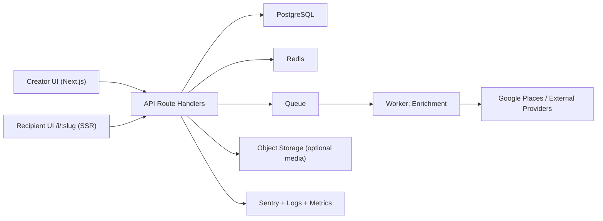

# Production Architecture

## System Overview

## Core Flows

1. Create Invite
- Client submits booking text or manual fields.
- API validates payload with zod.
- API parses text, extracts Swiggy restaurant ID, creates initial invite row.
- API enqueues enrichment job.
- API returns short URL (`/i/:slug`).

2. Enrichment
- Worker picks queue job.
- Fetches metadata and image candidates.
- Stores normalized restaurant details.
- Updates invite fields and enrichment status.

3. Share/Open
- Recipient opens `/i/:slug`.
- SSR fetches invite by slug.
- If invite exists and active, render stacked reveal page and OG tags.

4. RSVP
- Recipient submits response (`IN`, `MAYBE`, `OUT`).
- API writes participant response and emits analytics event.

## Reliability Requirements

- API validation: strict schema checks on all mutable endpoints.
- Idempotency: create endpoint supports `Idempotency-Key`.
- Rate limits: per-IP and per-user on parse/create/enrich.
- Queue retries: exponential backoff + dead-letter queue.
- Fallbacks: deterministic image fallback when providers fail.

## Security Requirements

- Auth for creator dashboard (Clerk/Auth.js).
- Public read only by unguessable slug.
- Optional private invites with signed token query param.
- Row-level ownership checks for invite mutations.
- Secrets in runtime env only, never in client bundle.

## Performance Targets

- Public invite page P95 render: under 2.5s.
- Create invite API P95: under 500ms (without enrichment).
- OG image endpoint P95: under 800ms with cache.
- SSR cache for public invites: `s-maxage` + stale-while-revalidate.

## Observability

- Error tracking: Sentry frontend + backend.
- Structured logs: request ID, invite ID, endpoint, latency.
- Metrics:
- create success rate
- parse success rate
- enrich success rate
- invite open count
- RSVP conversion by invite

